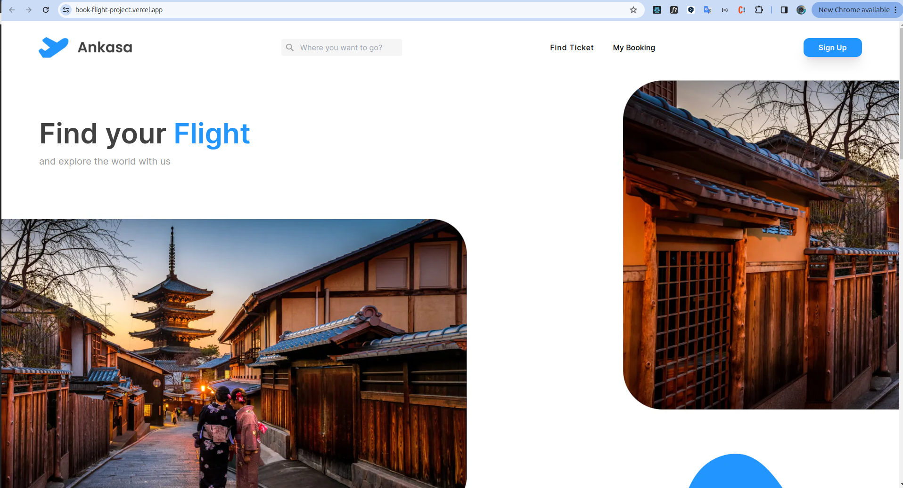

# About Bookflight Projects

book flight app
flight book application is a web-based airplane ticket booking application, this application makes it easy for everyone to book airplane tickets anytime and anywhere.

### Built With

[](https://github.com/rikiprimus/FE-hirejob/blob/main/README.md#built-with)

This app was built with some technologies below:

-   [Next Js](https:nextjs.org/)
-   [Tailwind CSS](https:tailwindcss.com/)
-   [React](https://reactjs.org/)
-   [Axios](https://axios-http.com/)
-   [Typescript](https://www.typescriptlang.org/)
-   [React Query](https://www.npmjs.com/package/react-query)

# Node Engine Version

v20.9.0

# UI Design

https://www.figma.com/design/8hgk1OVBDlMJuoez4w5yc1/Ankasa(Breakdown)?node-id=13936-544&t=BVVIJTyuUPaz22Wu-0

# User Account

email : jimmy@gmail.com
password : Jimmy123!

# Deploy on Vercel

The easiest way to deploy your Next.js app is to use the [Vercel Platform](https://vercel.com/new?utm_medium=default-template&filter=next.js&utm_source=create-next-app&utm_campaign=create-next-app-readme) from the creators of Next.js.

Check out our [Next.js deployment documentation](https://nextjs.org/docs/deployment) for more details.

Open [book-flight-project.vercel.app](https://book-flight-project.vercel.app/) with your browser to see the result.



# Getting Started

First, run the development server:

```shell
npm run dev
# or
yarn dev
# or
pnpm dev
# or
bun dev
```

Open [http://localhost:3000](http://localhost:3000/) with your browser to see the result.

You can start editing the page by modifying `app/page.tsx`. The page auto-updates as you edit the file.

# Learn More

[](https://github.com/albarmo/Interactive-Static-Map/blob/main/README.md#learn-more)

To learn more about Next.js, take a look at the following resources:

-   [Next.js Documentation](https://nextjs.org/docs) - learn about Next.js features and API.
-   [Learn Next.js](https://nextjs.org/learn) - an interactive Next.js tutorial.

You can check out [the Next.js GitHub repository](https://github.com/vercel/next.js/) - your feedback and contributions are welcome!
